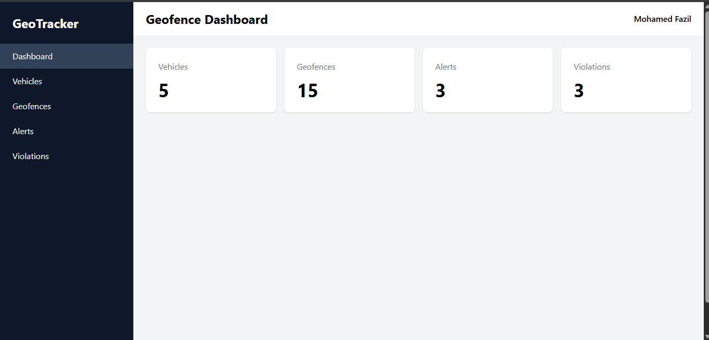
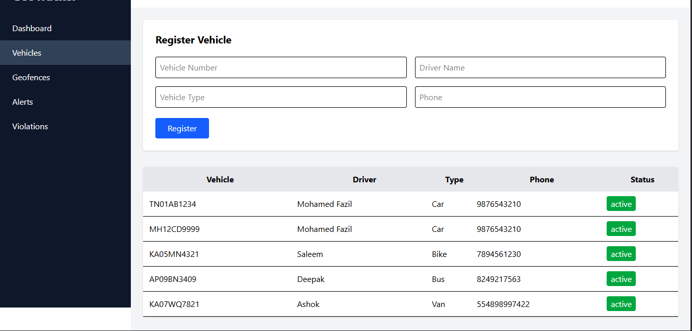
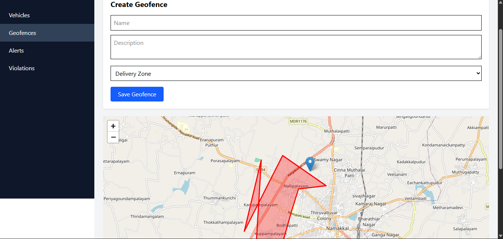
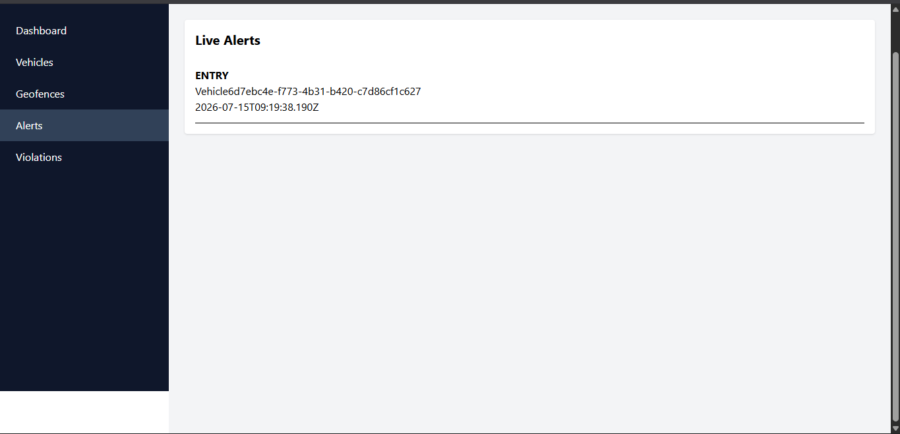
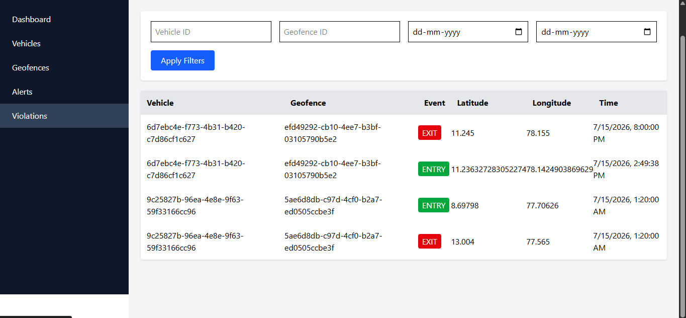

# Geofencing & Real-Time Alert System

A full-stack **real-time vehicle tracking and geofencing platform** built using **Go**, **React**, **PostgreSQL (PostGIS)**, **Leaflet**, **WebSockets**, and **Docker**.

The system tracks vehicle locations in real time, detects when vehicles enter or leave predefined geofenced areas, records violations, and delivers live alerts through WebSockets.

---

# Features

## Backend

- Vehicle Management
- Geofence Management
- Real-Time Vehicle Location Tracking
- Point-in-Polygon Detection
- Entry & Exit Detection
- Alert Configuration
- Violation History
- Dashboard Statistics API
- WebSocket Real-Time Alerts

---

## Frontend

- Dashboard
- Vehicle Management
- Interactive Leaflet Map
- Geofence Drawing
- Live Vehicle Tracking
- Real-Time Alert Feed
- Violation History
- Responsive User Interface

---

# Tech Stack

## Backend

- Go
- Gin
- GORM
- PostgreSQL
- PostGIS
- Gorilla WebSocket

## Frontend

- React
- TypeScript
- Vite
- Tailwind CSS
- React Leaflet
- Axios

## Infrastructure

- Docker
- Docker Compose

---

# Project Structure

```text
RealTimeAlertSystem/

├── backend/
│   ├── cmd/
│   ├── config/
│   ├── database/
│   ├── dto/
│   ├── handlers/
│   ├── middleware/
│   ├── models/
│   ├── repository/
│   ├── routes/
│   ├── services/
│   ├── utils/
│   └── websocket/
│
├── frontend/
│   ├── src/
│   │   ├── api/
│   │   ├── components/
│   │   ├── context/
│   │   ├── hooks/
│   │   ├── pages/
│   │   └── types/
│
├── docker-compose.yml
├── README.md
└── SETUP.md
```

---

# System Architecture

```text
                 React Frontend
                        │
        REST API + WebSocket Connection
                        │
                 Go (Gin Backend)
                        │
       ┌────────────────┴────────────────┐
       │                                 │
 PostgreSQL + PostGIS             WebSocket Hub
       │                                 │
 Vehicle / Geofence Data          Live Alerts
```

---

# Application Workflow

```text
Vehicle Location Update
          │
          ▼
POST /vehicles/location
          │
          ▼
Save Vehicle Location
          │
          ▼
Point-In-Polygon Detection
          │
          ▼
Entry / Exit Detection
          │
          ▼
Create Violation Record
          │
          ▼
Broadcast WebSocket Alert
          │
          ▼
Update Dashboard & Alert Feed
```

---

# REST API

## Vehicles

| Method | Endpoint                         | Description                 |
| ------ | -------------------------------- | --------------------------- |
| POST   | `/vehicles`                      | Create a new vehicle        |
| GET    | `/vehicles`                      | Retrieve all vehicles       |
| POST   | `/vehicles/location`             | Update vehicle location     |
| GET    | `/vehicles/location/:vehicle_id` | Get latest vehicle location |

---

## Geofences

| Method | Endpoint     | Description            |
| ------ | ------------ | ---------------------- |
| POST   | `/geofences` | Create a geofence      |
| GET    | `/geofences` | Retrieve all geofences |

---

## Alerts

| Method | Endpoint            | Description                        |
| ------ | ------------------- | ---------------------------------- |
| POST   | `/alerts/configure` | Configure alert settings           |
| GET    | `/alerts`           | Retrieve alerts                    |
| GET    | `/ws/alerts`        | WebSocket endpoint for live alerts |

---

## Violations

| Method | Endpoint              | Description                |
| ------ | --------------------- | -------------------------- |
| GET    | `/violations/history` | Retrieve violation history |

---

## Dashboard

| Method | Endpoint     | Description          |
| ------ | ------------ | -------------------- |
| GET    | `/dashboard` | Dashboard statistics |

---

# Getting Started

## Clone Repository

```bash
git clone https://github.com/MohamedFazil1406/RealTimeAlertSystem.git

cd RealTimeAlertSystem
```

---

## Backend Setup

```bash
cd backend

go mod tidy

go run ./cmd
```

---

## Frontend Setup

```bash
cd frontend

npm install

npm run dev
```

---

## Docker

```bash
docker compose up --build
```

---

# Screenshots

| Dashboard                           | Vehicle Management                |
| ----------------------------------- | --------------------------------- |
|  |  |

| Geofence & Live Tracking           | Alert Feed                      |
| ---------------------------------- | ------------------------------- |
|  |  |

| Violation History                   |
| ----------------------------------- |
|  |

---

# Future Improvements

- Vehicle movement simulation
- Route history visualization
- JWT Authentication
- Role-Based Access Control (RBAC)
- Email/SMS Notifications
- Multi-vehicle live tracking
- Heatmap analytics

---

# Author

**Mohamed Fazil**

- GitHub: https://github.com/MohamedFazil1406
- LinkedIn: _(Add your LinkedIn profile here)_

---

# License

This project is licensed under the **MIT License**.
